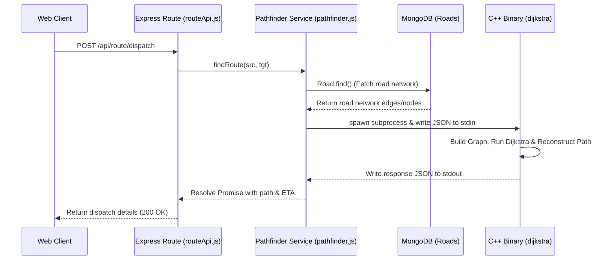

# Codebase Architecture & Data Structures (DSA) Guide

This document explains the organization of the codebase, detailing the purpose of each directory and file, with a specific focus on the **Data Structures and Algorithms (DSA)** implementation used for routing.

---

## 📂 Project Structure Overview

The project is structured as a full-stack real-time emergency vehicle dispatch system, split into three main directories:

```text
├── client/                     # Frontend client (React + Vite)
│   ├── public/                 # Static assets
│   └── src/                    # React frontend application code
│       ├── components/         # UI Components (Dispatch, Maps, Logs)
│       ├── services/           # API and WebSocket communication
│       ├── App.jsx             # Main App layout and state coordination
│       └── index.css           # Styling
│
├── server/                     # Backend server (Express + Node.js)
│   ├── models/                 # Mongoose schemas (MongoDB database models)
│   ├── routes/                 # Express API endpoints
│   ├── services/               # Core business services (wrappers, sockets)
│   ├── index.js                # Server entry point
│   ├── cluster.js              # Multi-process clustering support
│   └── seed.js                 # Seeding script for mock roads/incidents
│
└── cpp/                        # High-performance routing engine (C++)
    ├── dijkstra.cpp            # Core DSA implementation of Dijkstra's algorithm
    ├── json.hpp                # nlohmann/json single-header parser
    └── Makefile                # Build configuration to compile C++ to a binary
```

---

## 🧠 The DSA Core: Routing Algorithm

The system's core algorithmic challenge is finding the fastest route (minimum travel time) for an ambulance to reach an incident, bypassing heavy traffic or closed roads. This is solved using **Dijkstra's Shortest Path Algorithm** implemented in C++ for optimal performance.

### 1. The Graph Representation
To perform graph traversal, the database road model is converted into an in-memory graph representation.

* **Vertices (Nodes)**: Intersection points or waypoints where roads meet. Represented by unique string IDs (e.g., node names/coordinates).
* **Edges (Roads)**: Directed/Undirected links connecting two vertices. Each edge possesses a physical length (`distance_km`), a maximum speed limit (`speed_kmh`), a traffic `congestion` coefficient (from `0.0` to `1.0`), and a closure flag (`is_closed`).

In C++ ([cpp/dijkstra.cpp](file:///Users/karuneshvijaychikne/Downloads/Dsa3_proj/cpp/dijkstra.cpp)), the graph is represented using:
* A `std::map<std::string, int> idx` to map string node IDs to sequential integer indices `[0, N-1]`.
* An adjacency list representation `std::vector<std::vector<std::tuple<int, double>>> adj(N)` where each vertex `u` maps to a list of its neighbors `v` and the corresponding travel time (weight) between them.

---

### 2. Edge Weight Calculation (Cost Function)
Rather than finding the shortest path by physical distance, the algorithm calculates the **fastest path by travel time (ETA)**. This introduces dynamic edge weights:

$$\text{effective\_speed} = \text{speed\_kmh} \times (1.0 - \text{congestion})$$

$$\text{weight (eta\_min)} = \left(\frac{\text{distance\_km}}{\text{effective\_speed}}\right) \times 60.0$$

* If `is_closed` is true, the edge is omitted from the adjacency list entirely (effectively giving it a weight of $\infty$).
* The effective speed is clamped to a minimum of $1.0\text{ km/h}$ to prevent division by zero or negative weights (which would break Dijkstra's non-negative edge weight constraint).

---

### 3. Dijkstra's Algorithm Implementation
The algorithm finds the shortest path from the source node to all other nodes (specifically terminating or backtracking once the target is processed).

#### Data Structures Used:
1. **Priority Queue (`std::priority_queue`)**: A min-heap implementation used to retrieve the vertex with the minimum tentative travel time. It stores `std::pair<double, int>` (`{eta_min, node_index}`) sorted in ascending order of travel time:
   ```cpp
   std::priority_queue<PII, std::vector<PII>, std::greater<PII>> pq;
   ```
2. **Distance Vector (`std::vector<double> dist`)**: Tracks the shortest known travel time from the source to every node. Initialized to a very large value ($10^{18}$).
3. **Predecessor Vector (`std::vector<int> prev`)**: Tracks the parent/predecessor node for each node along its shortest path, enabling path reconstruction. Initialized to `-1`.

#### Algorithm Walkthrough:
```cpp
// 1. Initialize distance and push start node
dist[src] = 0;
pq.push({0.0, src});

while (!pq.empty()) {
    // 2. Extract node with the smallest tentative travel time
    auto [d, u] = pq.top(); pq.pop();
    
    // 3. Skip obsolete entries (lazy deletion optimization)
    if (d > dist[u]) continue;
    
    // 4. Relax edges of the current node
    for (auto& [v, w] : adj[u]) {
        if (dist[u] + w < dist[v]) {
            dist[v] = dist[u] + w;
            prev[v] = u;
            pq.push({dist[v], v});
        }
    }
}
```

#### Time Complexity:
Using a binary min-heap (via `std::priority_queue`), the time complexity is:
$$\mathcal{O}((V + E) \log V)$$
where $V$ is the number of vertices (nodes) and $E$ is the number of edges (roads). This is highly efficient for real-time dispatch systems compared to an unoptimized $\mathcal{O}(V^2)$ approach.

---

### 4. Path Reconstruction
After Dijkstra completes, the path to the target is reconstructed by backtracking from `tgt` to `src` using the `prev` array:

```cpp
vector<string> path;
if (dist[tgt] < 1e17) { // If reachable
    map<int,string> rev;
    for (auto& [k,v] : idx) rev[v] = k; // Map integer ID back to string ID
    for (int cur = tgt; cur != -1; cur = prev[cur])
        path.push_back(rev[cur]);
    reverse(path.begin(), path.end()); // Reverse to get source -> target
}
```

---

## 🔗 How NodeJS Interfaces with the C++ DSA Engine

To keep the application high-performing while maintaining a standard JavaScript backend, Node.js delegates the intensive graph algorithms to the C++ binary via **Inter-Process Communication (IPC)**.



1. **Express Route Handler** ([server/routes/routeApi.js](file:///Users/karuneshvijaychikne/Downloads/Dsa3_proj/server/routes/routeApi.js)): Receives the HTTP request and calls `findRoute(origin, destination)`.
2. **Pathfinder Wrapper** ([server/services/pathfinder.js](file:///Users/karuneshvijaychikne/Downloads/Dsa3_proj/server/services/pathfinder.js)):
   - Queries MongoDB for all active roads.
   - Maps them to a JSON payload containing node lists, edge parameters, source, and destination.
   - Spawns the compiled C++ executable:
     ```javascript
     const proc = spawn(path.resolve(__dirname, '../../cpp/dijkstra'));
     ```
   - Writes the JSON payload to the child process's `stdin` and closes it.
   - Accumulates output from `stdout` and parses the final path array and ETA value.

---

## 🛠️ Summary of Key DSA Files to Reference

* **[cpp/dijkstra.cpp](file:///Users/karuneshvijaychikne/Downloads/Dsa3_proj/cpp/dijkstra.cpp)**: Contains the graph construction, weight (travel time) computation, Dijkstra's algorithm, and path backtracking.
* **[server/services/pathfinder.js](file:///Users/karuneshvijaychikne/Downloads/Dsa3_proj/server/services/pathfinder.js)**: Responsible for database-to-graph translation and piping JSON inputs/outputs to and from the C++ binary.
* **[server/models/Road.js](file:///Users/karuneshvijaychikne/Downloads/Dsa3_proj/server/models/Road.js)**: Database schema defining vertices (`from`/`to`) and edge attributes (`speed_kmh`, `congestion`, `is_closed`).
