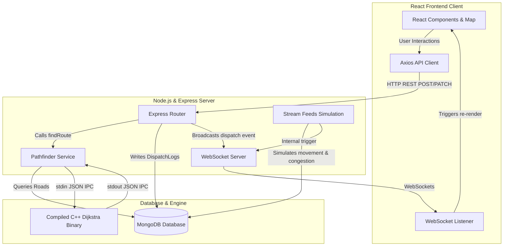

# Codebase Guide: Emergency Dispatch & Routing Console

This document provides a comprehensive overview of the application's architecture, file structure, database models, request lifecycles, and a detailed mathematical and algorithmic breakdown of the routing engine.

---

## 1. One-paragraph summary

This project is a real-time emergency dispatch and performance tracking system designed to route ambulances to incident locations along the fastest possible paths. The system queries active road conditions from a database, passes this map data to a high-performance C++ backend that calculates optimal travel routes by factoring in speed limits and traffic congestion, and streams real-time updates—such as ambulance GPS coordinates and new incidents—to an interactive map console used by emergency operators.

---

## 2. Tech stack and why each piece exists

* **C++17**: Used to run high-performance Dijkstra shortest-path calculations to ensure pathfinding runs with minimal latency.
* **Node.js**: The backend execution environment used to run the server, coordinate database queries, interface with the C++ routing engine, and manage client connections.
* **Express**: The web framework for Node.js used to expose REST API endpoints for dispatching, logging arrival times, and retrieving status feeds.
* **Mongoose**: The Object-Data Modeling (ODM) library used to define structured database schemas and execute queries against MongoDB.
* **ws (WebSockets)**: A WebSocket server library for Node.js used to broadcast real-time telemetry (ambulance movements, traffic changes, and active incidents) to all connected frontends.
* **React**: The frontend user interface library used to build the interactive dispatch dashboard and real-time operations console.
* **Vite**: The build tool and frontend development server used to bundle React assets and provide fast hot-module replacement during development.
* **Leaflet & React-Leaflet**: The mapping engine and its React components used to render the city grid, nodes, road conditions, ambulance markers, and path overlays.
* **Axios**: The HTTP client library used by the React client to send asynchronous requests to backend REST endpoints.
* **Lucide-React**: The icon library used to render responsive UI symbols throughout the dispatch console.
* **dotenv**: A Node.js configuration module used to load server configuration parameters (port numbers and database connection URIs) from environment files.

---

## 3. Architecture diagram

The following diagram illustrates the flow of data, queries, and execution commands through the full-stack system:



---

## 4. File-by-file reference

| File Path | Purpose | Key Exports | Key Imports & Dependencies |
| :--- | :--- | :--- | :--- |
| [`cpp/dijkstra.cpp`](file:///Users/karuneshvijaychikne/Downloads/Dsa3_proj/cpp/dijkstra.cpp) | Core routing script that builds an adjacency list from JSON stdin, runs Dijkstra's algorithm, and outputs the optimal path as JSON. | *N/A (Compiled Binary)* | `<iostream>`, `<vector>`, `<string>`, `<map>`, `<queue>`, `<tuple>`, `<algorithm>`, `<utility>`, `"json.hpp"` |
| [`cpp/Makefile`](file:///Users/karuneshvijaychikne/Downloads/Dsa3_proj/cpp/Makefile) | Compilation script for the C++ compiler. | *N/A* | Build instructions for `g++` |
| [`server/index.js`](file:///Users/karuneshvijaychikne/Downloads/Dsa3_proj/server/index.js) | Bootstraps the Express application, establishes MongoDB connection, mounts API routes, configures the WebSocket server, and initiates background simulations. | `broadcast` function | `express`, `http`, `ws`, `mongoose`, `cors`, `dotenv`, `./routes/*`, `./services/streamFeeds` |
| [`server/cluster.js`](file:///Users/karuneshvijaychikne/Downloads/Dsa3_proj/server/cluster.js) | Primary clustering supervisor that forks multiple worker instances to scale backend request-handling across CPU cores. | *N/A (Main script)* | `cluster`, `os`, `./index.js` |
| [`server/seed.js`](file:///Users/karuneshvijaychikne/Downloads/Dsa3_proj/server/seed.js) | Clears previous collections and populates the database with initial coordinates, roads, and active incidents. | `nodeLocations` coordinate object | `mongoose`, `models/Road`, `models/Incident`, `models/Ambulance`, `models/DispatchLog`, `dotenv` |
| [`server/models/Ambulance.js`](file:///Users/karuneshvijaychikne/Downloads/Dsa3_proj/server/models/Ambulance.js) | MongoDB schema defining fields, status enums, and location coordinates for ambulance units. | Mongoose `Ambulance` model | `mongoose` |
| [`server/models/DispatchLog.js`](file:///Users/karuneshvijaychikne/Downloads/Dsa3_proj/server/models/DispatchLog.js) | MongoDB schema recording historical runs, path arrays, operator IDs, ETAs, and accuracy calculations. | Mongoose `DispatchLog` model | `mongoose` |
| [`server/models/Incident.js`](file:///Users/karuneshvijaychikne/Downloads/Dsa3_proj/server/models/Incident.js) | MongoDB schema storing reported incidents, severity tiers, coordinate positions, and associated closed road segments. | Mongoose `Incident` model | `mongoose` |
| [`server/models/Road.js`](file:///Users/karuneshvijaychikne/Downloads/Dsa3_proj/server/models/Road.js) | MongoDB schema mapping intersections (`from`/`to`), distance measurements, speed profiles, and active traffic levels. | Mongoose `Road` model | `mongoose` |
| [`server/routes/ambulanceApi.js`](file:///Users/karuneshvijaychikne/Downloads/Dsa3_proj/server/routes/ambulanceApi.js) | Exposes GET endpoint to fetch a list of all ambulance units. | Express router | `express`, `models/Ambulance` |
| [`server/routes/incidentApi.js`](file:///Users/karuneshvijaychikne/Downloads/Dsa3_proj/server/routes/incidentApi.js) | Exposes GET and POST endpoints to fetch active emergencies or log new emergency incident requests. | Express router | `express`, `models/Incident` |
| [`server/routes/logApi.js`](file:///Users/karuneshvijaychikne/Downloads/Dsa3_proj/server/routes/logApi.js) | Handles log querying, applying filters (ambulance, date range, severity) and returning aggregated response statistics. | Express router | `express`, `models/DispatchLog` |
| [`server/routes/roadApi.js`](file:///Users/karuneshvijaychikne/Downloads/Dsa3_proj/server/routes/roadApi.js) | Retrieves all road segments and nested incident flags to draw the base street network on the map. | Express router | `express`, `models/Road` |
| [`server/routes/routeApi.js`](file:///Users/karuneshvijaychikne/Downloads/Dsa3_proj/server/routes/routeApi.js) | Coordinates routing calculations, launches the ambulance dispatch sequence, and records arrival completion metrics. | Express router | `express`, `services/pathfinder`, `models/DispatchLog`, `models/Ambulance` |
| [`server/services/pathfinder.js`](file:///Users/karuneshvijaychikne/Downloads/Dsa3_proj/server/services/pathfinder.js) | Queries active road networks, serializes the graph into JSON, and spawns the C++ binary to compute routes. | `findRoute` function | `child_process.spawn`, `path`, `models/Road` |
| [`server/services/streamFeeds.js`](file:///Users/karuneshvijaychikne/Downloads/Dsa3_proj/server/services/streamFeeds.js) | Orchestrates background timers that inject random congestion updates, stream incident records, and perturb GPS coordinates. | Simulation function | `models/Road`, `models/Incident`, `models/Ambulance` |
| [`client/src/main.jsx`](file:///Users/karuneshvijaychikne/Downloads/Dsa3_proj/client/src/main.jsx) | Entrypoint for Vite that bootstraps and mounts the React application layout. | *N/A* | `react`, `react-dom`, `App.jsx`, `index.css` |
| [`client/src/App.jsx`](file:///Users/karuneshvijaychikne/Downloads/Dsa3_proj/client/src/App.jsx) | Coordinates top-level React states (incidents, ambulances, and active routes) and configures socket message listeners. | Default React Component | `react`, `components/MapView`, `components/DispatchPanel`, `components/IncidentFeed`, `components/ResponseTimeLog`, `services/socket`, `services/api`, `lucide-react` |
| [`client/src/index.css`](file:///Users/karuneshvijaychikne/Downloads/Dsa3_proj/client/src/index.css) | Core CSS containing styling tokens, themes, layout systems, and glowing pulse marker animations. | *N/A* | CSS variables and core resets |
| [`client/src/services/api.js`](file:///Users/karuneshvijaychikne/Downloads/Dsa3_proj/client/src/services/api.js) | Wraps REST API requests utilizing Axios for clean asynchronous promise resolutions. | REST wrappers (`getRoads`, `dispatchAmbulance`, etc.) | `axios` |
| [`client/src/services/socket.js`](file:///Users/karuneshvijaychikne/Downloads/Dsa3_proj/client/src/services/socket.js) | Exposes helper functions to connect or disconnect WebSocket pipelines, handling reconnections on failure. | `connectSocket`, `closeSocket` | WebSocket browser APIs |
| [`client/src/components/DispatchPanel.jsx`](file:///Users/karuneshvijaychikne/Downloads/Dsa3_proj/client/src/components/DispatchPanel.jsx) | Handles dispatch form logic, auto-matches closest destination nodes using Euclidean distance, and controls arrival tracking. | Default React Component | `react`, `services/api`, `MapView` (for node coordinates), `lucide-react` |
| [`client/src/components/IncidentFeed.jsx`](file:///Users/karuneshvijaychikne/Downloads/Dsa3_proj/client/src/components/IncidentFeed.jsx) | Displays list items summarizing currently active incident severity levels, categories, and report times. | Default React Component | `lucide-react` |
| [`client/src/components/MapView.jsx`](file:///Users/karuneshvijaychikne/Downloads/Dsa3_proj/client/src/components/MapView.jsx) | Renders Leaflet mapping canvas populated with roads, markers, and neon route lines. | Default React Component, `nodeLocations` coordinates | `react`, `react-leaflet`, `leaflet`, `services/api` |
| [`client/src/components/ResponseTimeLog.jsx`](file:///Users/karuneshvijaychikne/Downloads/Dsa3_proj/client/src/components/ResponseTimeLog.jsx) | Displays historical run lists, performance charts, and exports historical run logs to CSV spreadsheets. | Default React Component | `react`, `services/api`, `lucide-react` |

---

## 5. DEEP DIVE — Data structures & algorithms

### Core Algorithmic Framework
The pathfinding engine uses **Dijkstra’s Shortest Path Algorithm** for single-source, single-target minimum cost routing. It runs inside the compiled C++ binary produced by [cpp/dijkstra.cpp](file:///Users/karuneshvijaychikne/Downloads/Dsa3_proj/cpp/dijkstra.cpp).

### Data Structure Choices
1. **Node Hash Map/Dictionary Mapping** (`std::map<string, int> idx`):
   To run operations over standard dynamic array indices, the program translates arbitrary string node labels (e.g., `"INT_A"`, `"HOSP_3"`) into sequential integers (`0` to `N-1`). A `std::map` (internally a Red-Black Tree) is chosen for this lookup. Although a `std::unordered_map` (hash table) would offer $\mathcal{O}(1)$ average-case lookup, `std::map` provides $\mathcal{O}(\log V)$ time complexity, which has negligible overhead for the small, static scale of the hospital routing grid (8 nodes) and guarantees lookup stability.
2. **Adjacency List** (`std::vector<std::vector<std::tuple<int, double>>> adj`):
   The road network is a sparse graph ($V = 8, E = 8$). Storing the graph as an adjacency list is ideal since it uses $\mathcal{O}(V + E)$ memory and allows iterating over a node's outgoing connections in $\mathcal{O}(\text{deg}(u))$ time. An adjacency matrix would consume $\mathcal{O}(V^2)$ memory and require scanning all $V$ entries to find neighbors, which is inefficient.
3. **Min-Priority Queue** (`std::priority_queue<PII, std::vector<PII>, std::greater<PII>>`):
   Implemented as a binary min-heap where `PII` represents `std::pair<double, int>` (storing `{accumulated_eta, node_index}`). It is used to fetch the node with the minimum tentative travel time in $\mathcal{O}(\log V)$ time. Using a flat array or list would require a linear scan $\mathcal{O}(V)$ to extract the minimum element, yielding an overall search complexity of $\mathcal{O}(V^2 + E)$.

---

### Step-by-Step Logic Trace

1. **Mapping String IDs to Contiguous Integers**:
   The code loops through the list of nodes parsed from standard input and maps unique strings to sequential integers:
   ```cpp
   map<string,int> idx;
   int N = 0;
   for (auto& n : input["nodes"]) {
       string node_id = n["id"].get<string>();
       if (idx.find(node_id) == idx.end()) {
           idx[node_id] = N++;
       }
   }
   ```
2. **Adjacency List Construction with Dynamic Weights**:
   The weight of each edge is calculated as the travel time (ETA) in minutes. The calculation uses the road's speed limit adjusted by its current congestion percentage. If the road is marked as closed, it is skipped entirely:
   ```cpp
   for (auto& e : input["edges"]) {
       if (e["is_closed"].get<bool>()) { closed_skipped++; continue; }
       
       string from_id = e["from"].get<string>();
       string to_id = e["to"].get<string>();
       
       if (idx.find(from_id) == idx.end() || idx.find(to_id) == idx.end()) {
           continue;
       }
       
       int u = idx[from_id];
       int v = idx[to_id];
       double dist  = e["distance_km"].get<double>();
       double speed = e["speed_kmh"].get<double>();
       double cong  = e.value("congestion", 0.0);
       double eff   = speed * (1.0 - cong);
       if (eff < 1.0) eff = 1.0;
       double eta   = (dist / eff) * 60.0;
       adj[u].emplace_back(v, eta);
       adj[v].emplace_back(u, eta); // bidirectional
   }
   ```
   *Note: If effective speed (`eff`) falls below $1.0\text{ km/h}$, it is clamped to $1.0$ to prevent division by zero or negative weights.*
3. **Initialization of Shortest Path States**:
   Distances are initialized to infinity ($10^{18}$), the start node distance is set to `0.0`, and the `prev` array is set to `-1`:
   ```cpp
   int src = idx[src_id];
   int tgt = idx[tgt_id];
   vector<double> dist(N, 1e18);
   vector<int>    prev(N, -1);
   priority_queue<PII, vector<PII>, greater<PII>> pq;
   dist[src] = 0;
   pq.push({0.0, src});
   ```
4. **Relaxation Loop (Core Dijkstra)**:
   The queue pops the minimum travel-time vertex `u`. If a shorter path to `u` was already processed, the entry is skipped (lazy deletion check). Otherwise, it relaxes all neighbors:
   ```cpp
   while (!pq.empty()) {
       auto [d, u] = pq.top(); pq.pop();
       if (d > dist[u]) continue;
       for (auto& [v, w] : adj[u]) {
           if (dist[u] + w < dist[v]) {
               dist[v] = dist[u] + w;
               prev[v] = u;
               pq.push({dist[v], v});
           }
       }
   }
   ```
5. **Path Reconstruction**:
   If the target was reached (`dist[tgt] < 1e17`), the program reconstructs the path backwards from `tgt` to `src` using the `prev` array and reverses it to get the correct chronological order:
   ```cpp
   vector<string> path;
   if (dist[tgt] < 1e17) {
       map<int,string> rev;
       for (auto& [k,v] : idx) rev[v] = k;
       for (int cur = tgt; cur != -1; cur = prev[cur])
           path.push_back(rev[cur]);
       reverse(path.begin(), path.end());
   }
   ```

---

### Complexity Analysis

* **Time Complexity**:
  * **Map Index Building**: $\mathcal{O}(V \log V)$ to register each unique node string into the lookup map.
  * **Graph Loading**: $\mathcal{O}(E \log V)$ to query and resolve string endpoints for each edge.
  * **Dijkstra Iterations**: Dijkstra's algorithm uses a binary heap. In the worst case, every edge relaxation inserts an element into the priority queue. The priority queue size is bounded by $\mathcal{O}(E)$. Each push/pop operation takes $\mathcal{O}(\log E) = \mathcal{O}(\log V^2) = \mathcal{O}(\log V)$ time. With at most $E$ insertions, the queue operations take $\mathcal{O}(E \log V)$ time. Finding adjacent edges takes $\mathcal{O}(V + E)$ time overall.
  * **Reconstruction**: $\mathcal{O}(V \log V)$ to build the reverse lookup map, and $\mathcal{O}(V)$ to traverse the path links.
  * **Overall Time Complexity**: $\mathcal{O}((V + E) \log V)$
* **Space Complexity**:
  * The adjacency list takes $\mathcal{O}(V + E)$ space.
  * The `dist` and `prev` arrays each take $\mathcal{O}(V)$ space.
  * The min-heap takes up to $\mathcal{O}(E)$ space.
  * **Overall Space Complexity**: $\mathcal{O}(V + E)$

---

### Edge Cases Handled

1. **Closed/Blocked Edges**:
   * *Handling*: The edge loop checks `is_closed` and skips inserting the edge into the adjacency list:
     ```cpp
     if (e["is_closed"].get<bool>()) { closed_skipped++; continue; }
     ```
2. **Missing Source or Target Nodes**:
   * *Handling*: If either string label is missing from the `idx` map, the program returns an empty path and an ETA of `-1` without running the algorithm:
     ```cpp
     if (idx.find(src_id) == idx.end() || idx.find(tgt_id) == idx.end()) {
         // ... outputs empty JSON results ...
         return 0;
     }
     ```
3. **No Path / Disconnected Components**:
   * *Handling*: If the target cannot be reached, its distance remains near infinity ($10^{18}$). The program checks this before backtracking:
     ```cpp
     if (dist[tgt] < 1e17) { /* reconstruct path */ }
     ```
     An ETA value of `-1` is returned:
     ```cpp
     out["eta_min"] = (dist[tgt] >= 1e17) ? -1 : dist[tgt];
     ```
4. **Source equals Target (`src == tgt`)**:
   * *Handling*: The distance to the source is initialized to `0.0`. It is popped first. Since `prev[tgt]` remains `-1`, the backtracking loop terminates immediately. The returned path contains only the source node itself: `[src]`, and the ETA is returned as `0.0`.

---

### Algorithmic Comparison

* **Bellman-Ford**:
  Runs in $\mathcal{O}(V \cdot E)$ time. While it handles negative edge weights, this feature is unnecessary for routing since travel times are strictly positive. Dijkstra's $\mathcal{O}((V + E)\log V)$ complexity is much faster.
* **Floyd-Warshall**:
  Runs in $\mathcal{O}(V^3)$ time to calculate all-pairs shortest paths. Since this application only requires single-source, single-destination paths when an operator triggers a dispatch, calculating all-pairs shortest paths would waste CPU cycles.
* **A\* Search**:
  Uses a heuristic (such as Euclidean distance) to guide the search towards the target. Although A* is typically faster than Dijkstra for spatial grids, it requires node coordinates. Given the small size of this graph (8 nodes), Dijkstra is optimal and avoids the overhead of heuristic calculations.
* **Breadth-First Search (Unweighted BFS)**:
  Runs in $\mathcal{O}(V + E)$ time but only works on unweighted graphs. Since road segments have varying speed limits, lengths, and congestion levels, BFS cannot be used.

---

### Optimizations Analysis

* **Missed Optimization: Early Exit**:
  The C++ code runs the search until the priority queue is empty: `while (!pq.empty())`. Since this is a single-source, single-destination search, the algorithm could terminate early as soon as the target node `tgt` is popped from the heap, as its shortest path is guaranteed to be found:
  ```cpp
  auto [d, u] = pq.top(); pq.pop();
  if (u == tgt) break; // Missed optimization
  ```
  While this would save redundant node expansions in larger graphs, it has no measurable impact on a network of only 8 nodes.
* **Decrease-Key Heap Operations**:
  The code uses lazy deletion, pushing updated node distances onto the heap instead of updating them in place. A Fibonacci heap or index-heap would support a true $\mathcal{O}(1)$ or $\mathcal{O}(\log V)$ `decrease_key` operation. However, the overhead of managing these complex data structures outweighs the cost of lazy deletion on small graphs.

---

## 6. Database / data model reference

The system defines four core Mongoose models inside `server/models/`.

| Model Name | Field Name | Data Type | Validation / Constraints | Read By | Written By |
| :--- | :--- | :--- | :--- | :--- | :--- |
| **`Ambulance`** | `callsign` | `String` | Required | `routes/ambulanceApi.js`, `routes/routeApi.js`, `services/streamFeeds.js` | `seed.js` |
| | `status` | `String` | Enum: `['available', 'dispatched', 'returning']` | `routes/routeApi.js`, `services/streamFeeds.js` | `routes/routeApi.js` (dispatch/arrival), `seed.js` |
| | `current_node` | `String` | Required | `routes/routeApi.js`, `services/streamFeeds.js` | `routes/routeApi.js`, `seed.js` |
| | `location.lat` | `Number` | Required | `services/streamFeeds.js`, frontend maps | `services/streamFeeds.js` (GPS drift), `seed.js` |
| | `location.lng` | `Number` | Required | `services/streamFeeds.js`, frontend maps | `services/streamFeeds.js` (GPS drift), `seed.js` |
| **`Incident`** | `title` | `String` | Required | `routes/incidentApi.js` (feed) | `routes/incidentApi.js` (POST), `seed.js` |
| | `location.lat` | `Number` | Required | `routes/incidentApi.js` | `routes/incidentApi.js` (POST), `seed.js` |
| | `location.lng` | `Number` | Required | `routes/incidentApi.js` | `routes/incidentApi.js` (POST), `seed.js` |
| | `type` | `String` | Enum: `['accident', 'fire', 'flood', 'road_closure']` | `routes/incidentApi.js` | `routes/incidentApi.js` (POST), `seed.js` |
| | `severity` | `String` | Enum: `['low', 'medium', 'high', 'critical']` | `routes/incidentApi.js`, `routes/logApi.js` | `routes/incidentApi.js` (POST), `seed.js` |
| | `road_ids` | `[ObjectId]` | Reference to `Road` schema | `routes/incidentApi.js` (populate) | `routes/incidentApi.js` (POST), `seed.js` |
| | `status` | `String` | Enum: `['active', 'resolved']`, default: `'active'` | `routes/incidentApi.js` | `routes/incidentApi.js` (POST), `seed.js` |
| | `reported_at` | `Date` | Default: `Date.now` | `routes/incidentApi.js` | `routes/incidentApi.js` (POST), `seed.js` |
| **`Road`** | `from` | `String` | Required | `services/pathfinder.js`, `routes/roadApi.js` | `seed.js` |
| | `to` | `String` | Required | `services/pathfinder.js`, `routes/roadApi.js` | `seed.js` |
| | `distance_km` | `Number` | Required | `services/pathfinder.js` | `seed.js` |
| | `speed_kmh` | `Number` | Required | `services/pathfinder.js` | `seed.js` |
| | `congestion` | `Number` | Default: `0` (Range: `0` to `1`) | `services/pathfinder.js`, `services/streamFeeds.js` | `services/streamFeeds.js` (randomizer), `seed.js` |
| | `is_closed` | `Boolean` | Default: `false` | `services/pathfinder.js`, `services/streamFeeds.js` | `seed.js` |
| | `incident_ref` | `ObjectId` | Reference to `Incident` schema | `routes/roadApi.js` | `seed.js` |
| **`DispatchLog`**| `ambulance_id` | `ObjectId` | Reference to `Ambulance`, Required | `routes/logApi.js`, `routes/routeApi.js` | `routes/routeApi.js` (POST), `seed.js` |
| | `incident_id` | `ObjectId` | Reference to `Incident`, Default `null` | `routes/logApi.js` | `routes/routeApi.js` (POST), `seed.js` |
| | `origin_node` | `String` | Required | `routes/routeApi.js` | `routes/routeApi.js` (POST), `seed.js` |
| | `destination_node`| `String` | Required | `routes/routeApi.js` | `routes/routeApi.js` (POST), `seed.js` |
| | `route_taken` | `[String]` | Array of Node strings | `routes/routeApi.js` | `routes/routeApi.js` (POST), `seed.js` |
| | `eta_min` | `Number` | Required | `routes/routeApi.js` | `routes/routeApi.js` (POST), `seed.js` |
| | `dispatch_time`| `Date` | Default: `Date.now` | `routes/logApi.js`, `routes/routeApi.js` | `routes/routeApi.js` (POST), `seed.js` |
| | `arrival_time` | `Date` | Default: `null` | `routes/logApi.js`, `routes/routeApi.js` | `routes/routeApi.js` (arrival updates) |
| | `actual_response_sec`| `Number` | Default: `null` | `routes/logApi.js`, `routes/routeApi.js` | `routes/routeApi.js` (arrival updates) |
| | `eta_accuracy_pct`| `Number` | Default: `null` | `routes/logApi.js` | `routes/routeApi.js` (arrival updates) |
| | `closed_roads_encountered`| `Number` | Default: `0` | `routes/logApi.js` | `routes/routeApi.js` (POST), `seed.js` |
| | `traffic_delay_min`| `Number` | Default: `null` | `routes/logApi.js` | `routes/routeApi.js` (arrival updates) |
| | `operator_id` | `String` | Default: `'unknown'` | `routes/logApi.js` | `routes/routeApi.js` (POST), `seed.js` |

---

## 7. Request lifecycle: Dispatching an Ambulance (POST `/api/route/dispatch`)

1. **User Action**:
   An operator selects an ambulance and a destination on the frontend, and clicks **Calculate & Dispatch Route**.
2. **API Call**:
   `handleCalculateAndDispatch()` in [DispatchPanel.jsx](file:///Users/karuneshvijaychikne/Downloads/Dsa3_proj/client/src/components/DispatchPanel.jsx#L66-L107) triggers the API wrapper `dispatchAmbulance()` in [api.js](file:///Users/karuneshvijaychikne/Downloads/Dsa3_proj/client/src/services/api.js#L10). This fires an HTTP POST request to `/api/route/dispatch`.
3. **Route Handling**:
   The request is received by the Express router in [routeApi.js](file:///Users/karuneshvijaychikne/Downloads/Dsa3_proj/server/routes/routeApi.js#L8-L44). It reads the request body and calls `findRoute(origin_node, destination_node)`.
4. **Graph Generation**:
   `findRoute` in [pathfinder.js](file:///Users/karuneshvijaychikne/Downloads/Dsa3_proj/server/services/pathfinder.js#L6-L51) queries MongoDB for all roads. It serializes the nodes and edges, along with the source and target nodes, into a JSON string.
5. **C++ Pathfinding execution**:
   `findRoute` spawns the compiled C++ binary using `child_process.spawn`. It writes the JSON string to the binary's `stdin` and listens for output:
   ```javascript
   const bin = path.resolve(__dirname, '../../cpp/dijkstra');
   const proc = spawn(bin);
   // ...
   proc.stdin.write(input);
   proc.stdin.end();
   ```
6. **Execution of Dijkstra**:
   The C++ binary reads the JSON input, constructs the adjacency list, and runs Dijkstra's algorithm to find the shortest path. It writes the result (the path array and ETA) back to `stdout` as a JSON string:
   ```cpp
   cout << out.dump() << "\n";
   ```
7. **Database Logging**:
   `routeApi.js` receives the resolved route. It creates a new `DispatchLog` record containing the calculated path, ETA, and operator ID.
8. **Status Update**:
   `routeApi.js` updates the status of the dispatched ambulance to `'dispatched'` and sets its `current_node` to the starting location:
   ```javascript
   await Ambulance.findByIdAndUpdate(ambulance_id, { 
     status: 'dispatched',
     current_node: origin_node 
   });
   ```
9. **Real-time Broadcast**:
   The server broadcasts the dispatch details to all connected clients over WebSockets:
   ```javascript
   broadcast('dispatch', { log, route: result });
   ```
10. **Frontend Update**:
    The WebSocket listener in [App.jsx](file:///Users/karuneshvijaychikne/Downloads/Dsa3_proj/client/src/App.jsx#L31-L44) receives the `'dispatch'` event. It updates the state, causing [MapView.jsx](file:///Users/karuneshvijaychikne/Downloads/Dsa3_proj/client/src/components/MapView.jsx) to draw the highlighted path on the map and [DispatchPanel.jsx](file:///Users/karuneshvijaychikne/Downloads/Dsa3_proj/client/src/components/DispatchPanel.jsx) to display the active run HUD.

---

## 8. Setup & run instructions

### Prerequisites
* A local instance of MongoDB running on `mongodb://127.0.0.1:27017`
* A C++ compiler supporting the C++17 standard (`g++` or `clang++`)
* Node.js (version 18 or higher recommended)

---

### Step 1: Compile the C++ Engine
Navigate to the `cpp` directory and build the routing binary using the provided `Makefile`:
```bash
cd cpp
make
```
*Note: This runs `g++ -O2 -std=c++17 -o dijkstra dijkstra.cpp`, compiling the engine to a local executable named `dijkstra`.*

---

### Step 2: Configure and Seed the Database
Navigate to the `server` directory and install the Node.js dependencies:
```bash
cd ../server
npm install
```
Confirm your MongoDB connection string in `server/.env` (no `.env.example` file is included in this repository):
```text
MONGO_URI=mongodb://127.0.0.1:27017/hospital_routes
PORT=5001
```
Next, seed the database with node locations, mock roads, and active incident templates:
```bash
npm run seed
```

---

### Step 3: Start the Backend Server
Start the backend server (which runs the clustered primary monitor and workers on port `5001`):
```bash
npm run dev
```

---

### Step 4: Configure and Run the Frontend Client
Open a new terminal window, navigate to the `client` directory, and install its dependencies:
```bash
cd client
npm install
```
Start the frontend development server on port `3000`:
```bash
npm run dev
```
Open your browser and navigate to `http://localhost:3000` to access the dispatch console.
